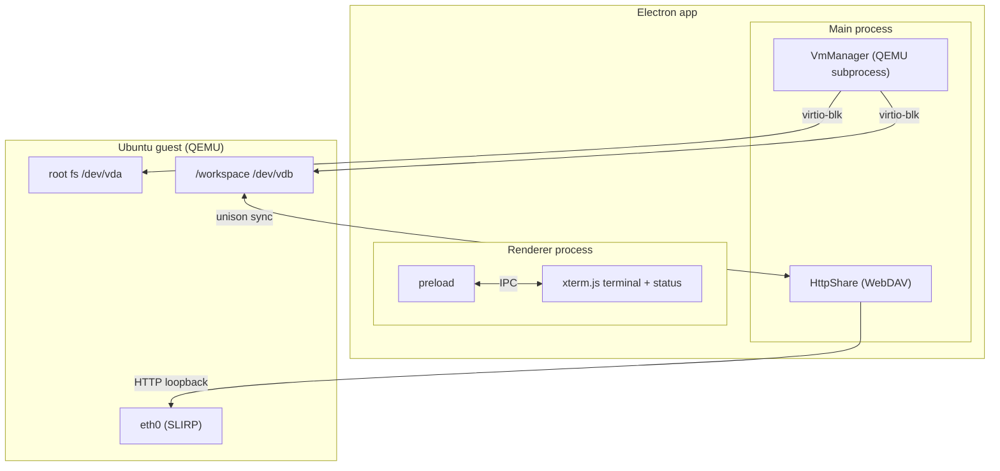

# ValenceBox

A secure, high-performance coding sandbox for an AI agent, running an x86-64
or aarch64 Ubuntu microVM under QEMU inside an Electron app. The agent is
isolated from the host but gets native-speed file I/O against a real ext4
disk; files sync bidirectionally between host and guest via WebDAV + unison.

## Architecture



- `VmManager` spawns QEMU as a subprocess with direct kernel boot, serial + QMP
  over TCP sockets, and two virtio-blk disks (root + workspace).
- `HttpShare` runs a plain-HTTP WebDAV server loopback-bound; the guest mirrors
  it into the workspace qcow2 using unison.
- The renderer displays an xterm.js terminal wired to the guest serial line and
  shows boot status (acceleration, timing).

## Components

| File | Role |
|------|------|
| `guest/Dockerfile` | Ubuntu 24.04 rootfs builder (x86-64 and arm64) |
| `src/main/vm-manager.ts` | QEMU subprocess wrapper (serial, QMP, lifecycle) |
| `src/main/http-share.ts` | WebDAV host share server |
| `src/main/guest-profile.ts` | Machine profile (pc/virt) + arch selection |
| `src/main/asset-paths.ts` | Arch-aware image/kernel/initrd paths |
| `src/main/main.ts` | Electron shell + VM lifecycle |
| `guest/usr/local/libexec/mount-share.sh` | First-boot format + /workspace mount |
| `guest/usr/local/libexec/workspace-sync.sh` | WebDAV mount + unison sync loop |

## Build

```sh
npm install
npm run images   # Ubuntu Docker guest → ext4 disks + kernel + initramfs (x86-64 + arm64)
npm run build    # compile TS → dist/
npm start        # launch the Electron app
```

`npm run images` requires Docker.

### Pointing `/workspace` at your own project

There is deliberately **no live host mount** (see HARDENING.md) — instead a
host directory is continuously synced with the guest's `/workspace` disk
(bidirectional, conflict-resolved). By default that directory is
`<Electron userData>/workspace` (macOS:
`~/Library/Application Support/valencebox/workspace`). Override it:

```sh
WORKSPACE_DIR=~/src/myproject npm start
```

Files present at boot are synced into the guest; edits on either side sync
within ~2 s while the app runs.

**Never synced** (any depth): `node_modules`, `.git`, `.DS_Store`,
`lost+found`. Run `npm install` inside the guest instead. Override workspace
disk size: `WORKSPACE_MB=<n> npm run images`.

## Test (headless, no display needed)

```sh
npm run test:boot     # boot to login, dual-disk /workspace, services
npm run test:qmp      # QMP protocol (save/restore, events)
npm run test:e2e      # full lifecycle
npm run test:ui       # headless renderer smoke test (Electron offscreen)
```

Set `SCRATCH=/path` to control where tests write host dirs (default `/tmp`),
`VERBOSE=1` to stream the guest serial console.

### Measured results (this machine, Apple Silicon)

- Cold boot to login: ~10 s (x86-64 TCG), <1 s (aarch64 HVF)
- Boot tests pass (x86-64) via `npm run test:boot`

## Security

See [HARDENING.md](HARDENING.md). Key invariants: no live host mount (files
cross only as WebDAV bytes over loopback), host directory is canonical so
durability never depends on VM disk internals.

## License

AGPL-3.0-only — see [`../LICENSE`](../LICENSE). Third-party attributions
(xterm.js, QEMU firmware blobs) are listed in
[`THIRD_PARTY_LICENSES.md`](THIRD_PARTY_LICENSES.md).
