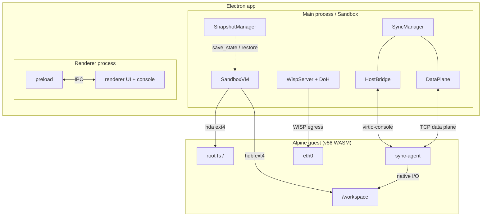

# ValenceBox

> [!NOTE]
> **Experimental Proof of Concept**
>
> ValenceBox is an experiment to explore how far a WebAssembly-based Linux
> sandbox can be pushed inside an Electron app. It is **not production-ready**
> and comes with significant limitations:
>
> - **Memory:** WASM does not support dynamic memory allocation, so despite v86
>   supporting memory ballooning, the VM cannot resize its RAM at runtime.
>   Memory management is suboptimal.
> - **CPU:** v86 emulates a single-core 32-bit x86 CPU only. SMP (multi-core)
>   is not implemented.
> - **File sync:** The workspace sync engine was built from scratch and is
>   alpha-quality at best. Conflicts, large trees, and edge cases are handled
>   minimally.
> - **Unknowns:** This was written as a personal exploration. There are likely
>   undiscovered bugs, race conditions, and security gaps.

A secure, high-performance coding sandbox for an AI agent, running an x86
Alpine Linux microVM in WebAssembly (v86) inside an Electron app. The agent is
isolated from the host but gets native-speed file I/O against a real ext4
disk; files sync bidirectionally between host and guest; internet egress is
proxied and allowlisted.

Built on v86 (via a small fork, see parent README) in the parent repo.
**v86 emulates 32-bit x86 only**, so the guest is 32-bit Alpine (see parent
README for why Fedora CoreOS can't run here).

## Architecture



- `HostBridge` is the low-latency control path carrying the framed protocol from `PROTOCOL.md`.
- `DataPlane` is the token-gated bulk-transfer path over the guest's virtio-net/WISP route, usually ~2-5x faster than the console.
- `SyncManager` owns manifest diffing, chunked transfer, and LWW conflict handling.
- `sync-agent` is a static Rust/i686 guest agent that watches `/workspace` and applies transfers.
- `WispServer + DoH` is the guest's sole allowlisted egress path.

Full walkthrough with diagrams (why two channels, how the data-plane VIP
trick works, why small files get batched):
[docs/data-plane-architecture.md](docs/data-plane-architecture.md).

## Components

| File | Role |
|------|------|
| `guest/Dockerfile` | 32-bit Alpine: kernel (legacy modules stripped), bash login, OpenRC services |
| `guest/sync-agent-rust/` | Rust sync agent (framing, manifest, chunked transfer, inotify, LWW) |
| `guest/rootfs/` | `/workspace` mount + sync-agent + networking OpenRC services |
| `src/shared/protocol.ts` | framed protocol (mirrors the Rust side) |
| `src/main/vm.ts` | headless v86 wrapper; **paced** virtio-console writer |
| `src/main/bridge.ts` | request/response + event routing over the console |
| `src/main/sync-manager.ts` | host side of bidirectional sync + conflict policy |
| `src/main/snapshot.ts` | periodic zstd `save_state()` / restore |
| `src/main/wisp.ts` + `doh.ts` | WISP egress relay + DNS-gated IP-pinned allowlist |
| `src/main/data-plane.ts` | TCP sync channel over virtio-net (in-process VIP, token-gated) |
| `src/main/sandbox.ts` | orchestrator tying it together (headless-usable) |
| `src/main/main.ts` + `preload.ts` + `src/renderer/` | Electron shell + UI (interactive xterm.js terminal + status bar) |

## Build

```sh
npm install
npm run images   # sync-agent (Rust, i686-unknown-linux-musl) → docker guest → ext4 disks + kernel
npm run build    # compile TS → dist/
npm start        # launch the Electron app
```

`npm run images` requires Docker (for the 32-bit Alpine build).

### Pointing `/workspace` at your own project

There is deliberately **no live host mount** (see HARDENING.md) — instead a
host directory is continuously synced with the guest's `/workspace` disk
(bidirectional, conflict-resolved). By default that directory is
`<Electron userData>/workspace` (macOS:
`~/Library/Application Support/valencebox/workspace`). Override it:

```sh
WORKSPACE_DIR=~/src/myproject npm start
```

Files present at boot are hydrated into the guest; edits on either side sync
within ~1 s while the app runs.

**Never synced** (any depth): `node_modules`, `.git`, `.DS_Store`,
`.sync-tmp`, `lost+found`. Host-native `node_modules` binaries would be
useless in the i386 Linux guest — run `npm install` inside the guest instead
(its `node_modules` stays guest-local too). Big manifests are sent chunked
across frames, so project size isn't limited by the protocol's 256 KiB frame
cap. Note the workspace disk defaults to 128 MB; override its size at
image-build time with `WORKSPACE_MB=<n> npm run images` if your project
needs more room (the guest runs `npm install` inside `/workspace`).

## Egress configuration

Place `sandbox.config.json` in Electron's `userData` directory
(`~/.config/ValenceBox/` on Linux) to configure the network allowlist. The
hardcoded default allows only package registries (npm, PyPI, crates.io, Go
proxy, Alpine apk mirrors) on ports 80 and 443.

```json
{
  "egress": {
    "extraHosts": ["my-registry.example.com", "llama-cpp.lan"],
    "extraPorts": [8000, [8080, 8082]]
  }
}
```

`extraHosts` and `extraPorts` append to the hardcoded defaults. To allow all
outbound traffic:

```json
{
  "egress": {
    "allowAll": true
  }
}
```

When `allowAll` is set, `extraHosts` and `extraPorts` are ignored.

## Test (headless, no display needed)

Each phase has a standalone harness that boots a real VM and asserts behavior:

```sh
npm run test:boot     # boot, dual-disk /workspace mount, virtio-console handshake
npm run test:sync     # bulk hydrate throughput + bidirectional sync + LWW conflict
npm run test:snapshot # zstd save_state → restore continues the session
npm run test:net      # WISP egress: allowlisted host works, others blocked
npm run test:dataplane # TCP data plane: throughput, token auth, restore re-dial
npm run test:e2e      # full Sandbox lifecycle incl. offline-drift reconciliation
npm run test:ui       # headless renderer smoke test (Electron offscreen)
```

Set `SCRATCH=/path` to control where tests write host dirs (default `/tmp`),
`VERBOSE=1` to stream the guest serial console.

### Measured results (this machine)

- Cold boot to ready: ~34 s; **warm restore from snapshot: ~0.3 s**
- Hydrate over the TCP data plane: 802-file / 22.9 MB tree in ~7.3 s vs a
  ~11.9 s console baseline (single big file ~7 MB/s; raw channel ~12 MB/s —
  the ceiling is the guest's emulated CPU). Small files are batched into
  TREE_PUT archives: ~3.9 ms guest work per file vs ~16 ms pushed
  individually. Console fallback: ~2.9 MB/s + ~5 ms/file, serial.
- Snapshot: 89 MB RAM state → ~33 MB zstd in ~0.3 s
- virtio-console ping RTT: <1 ms (control); TCP path RTT is tens of ms,
  which is why transfers pipeline 8-wide during hydrate

## Security

See [HARDENING.md](HARDENING.md). Key invariants: no live host mount (files
cross only as protocol bytes over ext4 disks), path-escape rejection on every
transfer, single allowlisted egress path (private/loopback IPs blocked),
canonical store on the host so durability never depends on VM disk internals.

## License

AGPL-3.0-only — see [`../LICENSE`](../LICENSE). Third-party attributions
(v86 assets, xterm.js, wisp-js) are listed in
[`THIRD_PARTY_LICENSES.md`](THIRD_PARTY_LICENSES.md).

## Notes & deviations from the original spec

- **virtio-blk → IDE.** v86 has no virtio-blk; disks enumerate as IDE
  (`/dev/sda`, `/dev/sdb`). The guest mount auto-detects via `blkid`, and root
  boots with `modules=ata_piix,sd-mod,ext4`. virtio-console/-net are used as
  specified.
- **Paced console writer.** v86's virtio-console drops bytes if the guest RX
  ring is empty; `vm.ts` slices to <4 KiB and only sends when a descriptor is
  free (with stall backoff). This was essential to get reliable bulk transfer.
- **Bounded disk block_cache.** Upstream v86's `hda`/`hdb` buffers cache
  every disk block ever read or written with no eviction, so host memory
  grows unboundedly with cumulative guest disk I/O (most visibly during
  workspace hydration). The `v86/` fork adds an opt-in `max_cache_bytes`
  bound with LRU eviction + write-back (see
  [semidark/v86#1](https://github.com/semidark/v86/pull/1)); `vm.ts`
  configures it and `SandboxVM.flushDisks()` proactively reclaims it after
  hydration and on each idle-triggered snapshot.
- **Egress = DNS gate + IP pinning.** v86's wisp adapter connects by resolved
  IP, so the allowlist is enforced in two layers: `doh.ts` only resolves
  allowlisted hostnames; `wisp.ts` only permits the IPs it pinned. Granularity
  caveat in HARDENING.md.
- Single console port multiplexes control + data (the spec's optional 4-port
  split is a latency optimization not yet needed).
- **Interactive terminal via xterm.js.** The renderer runs a real xterm.js
  terminal wired to the guest's serial line: output is interpreted as
  ANSI/VT100 and keystrokes stream straight through (colors, cursor, history,
  ctrl-c, tab completion). Vendored as UMD bundles into `dist/renderer/vendor/`
  by `scripts/copy-renderer.js` (no bundler). Limitation: `fitAddon.fit()`
  only resizes the *visual* viewport — plain serial has no way to renegotiate
  the guest's terminal columns (no TIOCSWINSZ over the wire), so the guest
  keeps its default width regardless of window size. Cosmetic only.
