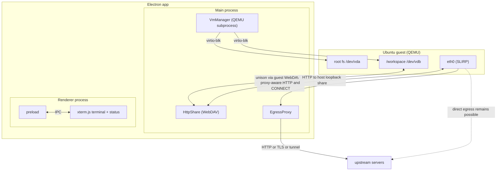

# ValenceBox

An experimental desktop coding sandbox for AI agents, running an x86-64
or aarch64 Ubuntu VM under QEMU inside an Electron app. Commands run in the
VM, with a local ext4 workspace disk and bidirectional host↔guest file sync
via WebDAV + unison. See [HARDENING.md](HARDENING.md) for implementation
limits; VM isolation and proxy configuration are not a current security audit.

## Architecture


```mermaid
flowchart TB
    subgraph App["Electron app"]
        direction TB
        subgraph Host["Main process"]
            direction LR
            VM["VmManager (QEMU subprocess)"]
            Share["HttpShare (WebDAV)"]
            Proxy["EgressProxy"]
        end
        subgraph Render["Renderer process"]
            direction LR
            Preload["preload"]
            Renderer["xterm.js terminal + status"]
        end
    end
    subgraph Guest["Ubuntu guest (QEMU)"]
        direction LR
        Root["root fs /dev/vda"]
        Work["/workspace /dev/vdb"]
        Net["eth0 (SLIRP)"]
    end
    UpstreamHost["upstream servers"]
    Preload <-->|IPC| Renderer
    VM -->|virtio-blk| Root
    VM -->|virtio-blk| Work
    Work <-->|unison via guest WebDAV mount| Share
    Net <-->|HTTP to host loopback share| Share
    Net -->|proxy-aware HTTP and CONNECT| Proxy
    Proxy -->|HTTP or TLS or tunnel| UpstreamHost
    Net -.->|direct egress remains possible| UpstreamHost
```

- `VmManager` spawns QEMU with direct kernel boot and two virtio-blk disks
  (root + workspace). Serial, QMP and PTY use Unix sockets on Linux/macOS and
  loopback TCP sockets on Windows.
- `HttpShare` runs a plain-HTTP WebDAV server loopback-bound; the guest mirrors
  it into the workspace qcow2 using unison.
- `EgressProxy` filters requests from proxy-aware clients and optionally performs
  TLS interception (MITM) for secret injection. Guest environment variables do
  not enforce mandatory egress: clients can bypass the proxy through SLIRP.
- The renderer displays an xterm.js terminal using the PTY channel with serial
  fallback, plus boot status (acceleration, timing). Node integration is disabled
  and context isolation enabled; Electron's renderer sandbox is explicitly off.

### Machine selection and capability status

| Guest | Resolved accelerator | QEMU machine | Virtio transport |
|---|---|---|---|
| x86-64 | Hardware acceleration | `microvm` | MMIO (`-device`) |
| x86-64 | `tcg,thread=multi` (including forced `accel: "tcg"`) | `pc` | PCI (`-pci`) |
| x86-64 | Bare `tcg` (macOS auto mode) | `microvm` (current mapping gap) | MMIO (`-device`) |
| aarch64 | HVF or TCG | `virt` | PCI (`-pci`) |

This reflects `src/main/guest-profile.ts`, not boot verification on every
platform. On Apple Silicon, architecture selection checks the aarch64 binary
and root image; remaining assets are required at launch. Missing selection
assets defaults to x86-64. Explicit `guest` configuration overrides automatic
selection. Forced `accel: "tcg"` keeps the selected architecture. HVF availability
is assumed on Apple Silicon, not probed; startup failure may still fail launch
because the CPU arguments are chosen before QEMU tries fallback candidates.
For x86-64 macOS auto mode, bare `tcg` currently selects `microvm`, unlike forced
TCG's `pc`; this is not a verified working boot path. See [docs/qemu.md](docs/qemu.md).

**Snapshots are not implemented.** The legacy `saveSnapshot` IPC handler is a
no-op; remaining UI/types do not establish a functioning backend. QMP migration
and compressed snapshots are future proposals, including disk-state consistency
requirements for any RAM/device-state restore. The app defaults to 4096 MB RAM
and 2 vCPUs, configurable with `memMb` and `smp`.

## Components

| File | Role |
|------|------|
| `guest/Dockerfile` | Ubuntu 24.04 rootfs builder (x86-64 and arm64) |
| `src/main/vm-manager.ts` | QEMU subprocess wrapper (serial, QMP, lifecycle) |
| `src/main/http-share.ts` | WebDAV host share server |
| `src/main/guest-profile.ts` | Machine profile (microvm/pc/virt) + arch selection |
| `src/main/asset-paths.ts` | Arch-aware image/kernel/initrd paths |
| `src/main/main.ts` | Electron shell + VM lifecycle |
| `guest/usr/local/libexec/mount-share.sh` | First-boot format + /workspace mount + proxy env + CA install |
| `guest/usr/local/libexec/workspace-sync.sh` | WebDAV mount + unison sync loop |
| `src/main/egress-proxy.ts` | HTTP CONNECT forward proxy with MITM TLS interception |
| `src/config.ts` | `EgressConfig`, `SecretSpec`, `EgressRuntimeConfig` types |

## Build

```sh
npm install
npm run images:all # Ubuntu Docker guest → disks + kernel + initramfs for both architectures
npm run build    # compile TS → dist/
npm start        # launch the Electron app
```

Image builds require Docker and `qemu-img`; runtime also needs the staged QEMU
binary and firmware. `npm run images` builds only the host architecture;
`npm run images:all` builds both. See [docs/build-from-source.md](docs/build-from-source.md)
for Apple Silicon build prerequisites and QEMU staging instructions.

### Pointing `/workspace` at your own project

There is no **direct host filesystem passthrough** such as 9p/virtiofs.
The guest mounts the WebDAV share at `/host-workspace` and unison syncs it with
`/workspace` on its own disk. Conflicts prefer the host copy. By default the
host share is the persistent `<Electron userData>/workspace` directory. Quit
preserves workspace data and removes only known VM runtime files. Workspaces
from older versions under `qemu-*/workspace` remain in place; set `workspaceDir`
to one of those paths to reuse it. Use an existing project directory explicitly:

```sh
WORKSPACE_DIR=~/src/myproject npm start
```

When the share is mounted and sync succeeds, files present at boot are copied
into the guest and edits are reconciled by unison (`-repeat 2`). This is a poll
setting, not a guaranteed two-second latency. Guest-only changes can be lost
before reaching the host; startup marker checks and host conflict preference
do not establish crash-safe or mount-loss-safe synchronization.

**Never synced** (any depth): `node_modules`, `.git`, `.DS_Store`,
`lost+found`. Run `npm install` inside the guest instead. Override workspace
disk size: `WORKSPACE_MB=<n> npm run images`.

## Egress proxy configuration

Guest proxy environment variables direct cooperating HTTP/HTTPS clients to
`EgressProxy`; WebDAV uses the separate direct share path. These settings do
not block direct network access by clients that ignore them. Configure the proxy via
`sandbox.config.json` in the Electron `userData` directory
(`~/Library/Application Support/valencebox/` on macOS):

Use **strict JSON**: comments or trailing commas cause the current loader to
silently fall back to empty configuration, discarding the intended policy.
This example configures host filtering without real credentials:

```json
{
  "egress": {
    "policy": "allowlist",
    "allowHosts": ["pypi.org", "*.pythonhosted.org"],
    "denyHosts": [],
    "allowPorts": [80, 443],
    "allowAll": false,
    "enableMitm": false,
    "secrets": [],
    "maxConnections": 256,
    "rateLimitPerMin": 0,
    "listenHost": "0.0.0.0"
  }
}
```

Secret specs support inline `value`, host `fromEnv`, or `fromFile` (with `~`
expansion). Inline values are stored in the config file. Review the limitations
below before provisioning credentials; declaring `secrets[*].hosts` does not
also add those hosts to the global allowlist. Custom `caCertFile` must point
to a readable PEM bundle.

| Key | Default | Description |
|-----|---------|-------------|
| `policy` | `"none"` | `"allowlist"` = only `allowHosts`; `"denylist"` = block `denyHosts`; `"none"` = allow all |
| `allowHosts` | `[]` | Hostnames/wildcards allowed (when policy is `"allowlist"`) |
| `denyHosts` | `[]` | Deny rules win in allowlist/denylist modes; ignored for `policy: "none"` or `allowAll: true` |
| `allowPorts` | `[80, 443]` | Enforced for proxied forwarding and CONNECT, even with `policy: "none"` or `allowAll: true`; `[]` removes the port restriction |
| `allowAll` | `false` | Bypass host filtering only; authentication and port checks remain |
| `enableMitm` | `false` | When `true`, TLS connections to secret hosts are intercepted, placeholders replaced with real secrets, and re-encrypted upstream |
| `secrets` | `[]` | List of credential specs: `env` (guest var name), `value` / `fromFile` / `fromEnv` (source), `hosts` (which hosts trigger MITM). Priority: `value` > `fromFile` > `fromEnv` |
| `caCertFile` | — | PEM bundle used to verify upstream TLS servers in addition to the system trust store (for internal/self-signed upstreams). Supports `~` |
| `maxConnections` | `256` | Reject over-limit TCP connections with `503`; accounting recovery has a known gap (see HARDENING.md) |
| `rateLimitPerMin` | `0` | Max requests/CONNECTs per client IP per minute; over-limit returns `429`. `0` disables |
| `listenHost` | `"0.0.0.0"` | Interface the proxy binds to (guest reaches it via the SLIRP gateway `10.0.2.2`) |

Runtime MITM CA and leaf generation uses pure Node (`selfsigned` →
`@peculiar/x509`), without host `openssl`. Integration fixtures still use it.

### How MITM works

1. When `enableMitm: true`, the proxy generates or reuses a persistent CA in
   `mitm-ca/` under `userData`; it is not a new ephemeral CA each session.
2. The CA certificate is passed to the guest via QEMU `fw_cfg` and installed by
   `mount-share.sh` at boot (`update-ca-certificates`).
3. For each host listed in `secrets[*].hosts`, the proxy TLS-terminates the
   connection, replaces placeholder strings in headers/body with the real secret
   values, and re-encrypts upstream.
4. Guest environment variables are provisioned with placeholders, not real
   credentials. This does not prevent an upstream from echoing a credential
   back to the guest. Secret-rewriting paths buffer bodies and reject chunked
   transfer encoding.

**Important current limitations:** plain HTTP secret-host requests also rewrite
credentials even when MITM is off, transmitting them without upstream TLS.
Body rewriting lacks the destination authorization check present in header
rewriting. Upstream MITM TLS verification follows `NODE_TLS_REJECT_UNAUTHORIZED`;
never set it to `0` during normal app use. See [HARDENING.md](HARDENING.md) for
source evidence and follow-ups before using real credentials.

The proxy defaults to `0.0.0.0`, unlike the loopback-bound WebDAV share. Review
its listening interface and host firewall; token authentication is not equivalent
to loopback-only exposure.

### Verify from inside the guest

```sh
# Check proxy configuration without printing the proxy authentication token
[ -n "$HTTP_PROXY" ] && printf 'HTTP_PROXY is configured\n'

# Optional placeholder check for a configured TEST_SECRET; prints no value
case "$TEST_SECRET" in psbx-sec-*) printf 'Placeholder is configured\n' ;; esac
# This does not prove that upstream responses cannot disclose credentials.

# With MITM enabled, verify the installed CA
openssl verify -CAfile /etc/ssl/certs/ca-certificates.crt \
  /usr/local/share/ca-certificates/valencebox-mitm.crt

# Request using proxy environment; avoid -v (diagnostics can expose proxy tokens)
curl --silent --show-error --output /dev/null https://pypi.org
```

## Tests

Run the non-UI suites individually; there is no umbrella test script:

```sh
npm run test:unit     # guest profiles and generated QEMU argument assertions
npm run test:share    # WebDAV auth/CRUD/traversal assertions, no VM
npm run test:egress   # proxy policy and rewriting helpers (unit)
npm run test:qmp      # frozen QEMU query-status and process stop, no snapshots
npm run test:boot     # x86-64 login, /workspace disk layout and service status
```

QMP requires staged QEMU/firmware; boot also requires x86-64 guest images.
`test:boot` starts no host WebDAV share and does not verify a sync round-trip.
Neither `test:e2e` nor `test:snapshot` exists as an npm script; these are future
proposals, with no current full-lifecycle equivalent.

`test:egress:integration` exists for certificates, proxy auth/policy and injection.
Its self-signed injection fixture currently requires this **test-only** override
for the full suite (fixture generation also uses host `openssl`):

```sh
NODE_TLS_REJECT_UNAUTHORIZED=0 npm run test:egress:integration
```

That override weakens TLS verification for the process; never use it for normal
app operation. Passing the fixture is not a strict TLS/security audit.

`npm run test:ui` is an existing **legacy renderer smoke script** with a fake
preload and stale renderer fields. Requires a prior build and Electron/display
prerequisites (including a display server on Linux). Its stubbed restored status
is not snapshot implementation or production-isolation coverage.

`VERBOSE=1` enables extra logs. QMP/boot tests create temporary scratch storage
by default and delete their entire `SCRATCH` directory during cleanup. If you
override `SCRATCH`, use a dedicated disposable directory, never a project or
shared temp root.

### Performance measurement

Boot timing depends on guest architecture, accelerator, image and host. Measure
against a documented configuration before making performance claims;
`test:boot` reports its x86-64 login timing, not aarch64 HVF timing.

## Security

See [HARDENING.md](HARDENING.md) for source-scoped controls, test coverage and
known gaps—not a current security audit. The workspace uses WebDAV rather than
direct filesystem passthrough. The host directory is canonical by design, but
successful sync is required for guest edits to become durable there. Unrestricted
SLIRP, root guest privileges and credential-rewriting limitations remain relevant.

## License

AGPL-3.0-only — see [`../LICENSE`](../LICENSE). Third-party attributions
(xterm.js, QEMU firmware blobs) are listed in
[`THIRD_PARTY_LICENSES.md`](THIRD_PARTY_LICENSES.md).
