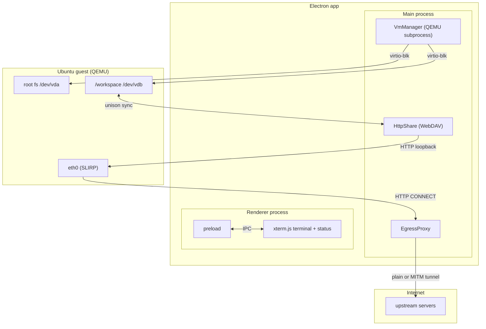

# ValenceBox

A secure, high-performance coding sandbox for an AI agent, running an x86-64
or aarch64 Ubuntu microVM under QEMU inside an Electron app. The agent is
isolated from the host but gets native-speed file I/O against a real ext4
disk; files sync bidirectionally between host and guest via WebDAV + unison.

## Architecture


```mermaid
flowchart TB
    subgraph App["Electron app"]
        direction TB
        subgraph Host["Main process"]
            direction LR
            VM["VmManager (QEMU subprocess)"]
            Share["HttpShare (WebDAV)"]
            Proxy["EgressProxy"]
        end

        subgraph Render["Renderer process"]
            direction LR
            Preload["preload"]
            Renderer["xterm.js terminal + status"]
        end
    end

    subgraph Guest["Ubuntu guest (QEMU)"]
        direction LR
        Root["root fs /dev/vda"]
        Work["/workspace /dev/vdb"]
        Net["eth0 (SLIRP)"]
    end

    subgraph Upstream["Internet"]
        UpstreamHost["upstream servers"]
    end

    Preload <-->|IPC| Renderer
    VM -->|virtio-blk| Root
    VM -->|virtio-blk| Work
    Share -->|HTTP loopback| Net
    Work <-->|unison sync| Share
    Net -->|HTTP CONNECT| Proxy
    Proxy -->|plain or MITM tunnel| UpstreamHost
```

- `VmManager` spawns QEMU as a subprocess with direct kernel boot, serial + QMP
  over TCP sockets, and two virtio-blk disks (root + workspace).
- `HttpShare` runs a plain-HTTP WebDAV server loopback-bound; the guest mirrors
  it into the workspace qcow2 using unison.
- `EgressProxy` runs an HTTP CONNECT forward proxy that all guest egress is
  routed through. It enforces allowlist/denylist policies and optionally performs
  TLS interception (MITM) for secret injection into credentialed requests.
- The renderer displays an xterm.js terminal wired to the guest serial line and
  shows boot status (acceleration, timing).

## Components

| File | Role |
|------|------|
| `guest/Dockerfile` | Ubuntu 24.04 rootfs builder (x86-64 and arm64) |
| `src/main/vm-manager.ts` | QEMU subprocess wrapper (serial, QMP, lifecycle) |
| `src/main/http-share.ts` | WebDAV host share server |
| `src/main/guest-profile.ts` | Machine profile (pc/virt) + arch selection |
| `src/main/asset-paths.ts` | Arch-aware image/kernel/initrd paths |
| `src/main/main.ts` | Electron shell + VM lifecycle |
| `guest/usr/local/libexec/mount-share.sh` | First-boot format + /workspace mount + proxy env + CA install |
| `guest/usr/local/libexec/workspace-sync.sh` | WebDAV mount + unison sync loop |
| `src/main/egress-proxy.ts` | HTTP CONNECT forward proxy with MITM TLS interception |
| `src/config.ts` | `EgressConfig`, `SecretSpec`, `EgressRuntimeConfig` types |

## Build

```sh
npm install
npm run images   # Ubuntu Docker guest → ext4 disks + kernel + initramfs (x86-64 + arm64)
npm run build    # compile TS → dist/
npm start        # launch the Electron app
```

`npm run images` requires Docker.

### Pointing `/workspace` at your own project

There is deliberately **no live host mount** (see HARDENING.md) — instead a
host directory is continuously synced with the guest's `/workspace` disk
(bidirectional, conflict-resolved). By default that directory is
`<Electron userData>/workspace` (macOS:
`~/Library/Application Support/valencebox/workspace`). Override it:

```sh
WORKSPACE_DIR=~/src/myproject npm start
```

Files present at boot are synced into the guest; edits on either side sync
within ~2 s while the app runs.

**Never synced** (any depth): `node_modules`, `.git`, `.DS_Store`,
`lost+found`. Run `npm install` inside the guest instead. Override workspace
disk size: `WORKSPACE_MB=<n> npm run images`.

## Egress proxy configuration

All guest HTTP/HTTPS traffic (except WebDAV share sync) is routed through a
host-process forward proxy (`EgressProxy`). Configure it via
`sandbox.config.json` in the Electron `userData` directory
(`~/Library/Application Support/valencebox/` on macOS):

```jsonc
{
  "guest": "aarch64",
  "egress": {
    "policy": "allowlist",            // "allowlist" | "denylist" | "none"
    "allowHosts": ["pypi.org", "*.pythonhosted.org"],
    "denyHosts": [],
    "enableMitm": false,              // TLS interception for secret injection
    "secrets": [
      // Inline value (caution — stored in config file):
      { "env": "MY_SECRET",    "value": "s3cr3t",                "hosts": ["service.example.com"] },
      // Read from host environment variable at startup:
      { "env": "GITHUB_TOKEN", "fromEnv": "GITHUB_TOKEN",        "hosts": ["api.github.com"] },
      // Read from a file on disk at startup (supports ~ expansion):
      { "env": "NPM_TOKEN",    "fromFile": "~/.secrets/npm.key", "hosts": ["registry.npmjs.org"] },
    ]
  }
}
```

| Key | Default | Description |
|-----|---------|-------------|
| `policy` | `"none"` | `"allowlist"` = only `allowHosts`; `"denylist"` = block `denyHosts`; `"none"` = allow all |
| `allowHosts` | `[]` | Hostnames/wildcards allowed (when policy is `"allowlist"`) |
| `denyHosts` | `[]` | Hostnames/wildcards always blocked |
| `enableMitm` | `false` | When `true`, TLS connections to secret hosts are intercepted, placeholders replaced with real secrets, and re-encrypted upstream |
| `secrets` | `[]` | List of credential specs: `env` (guest var name), `value` / `fromFile` / `fromEnv` (source), `hosts` (which hosts trigger MITM). Priority: `value` > `fromFile` > `fromEnv` |

### How MITM works

1. When `enableMitm: true`, the proxy generates an ephemeral CA on startup
   (persisted in `mitm-ca/` under `userData`).
2. The CA certificate is passed to the guest via QEMU `fw_cfg` and installed by
   `mount-share.sh` at boot (`update-ca-certificates`).
3. For each host listed in `secrets[*].hosts`, the proxy TLS-terminates the
   connection, replaces placeholder strings in headers/body with the real secret
   values, and re-encrypts upstream.
4. The guest **never sees** the real secret — only the placeholder. Chunked
   transfer-encoding is rejected on secret hosts (requires full body buffering).

### Verify from inside the guest

```sh
# Proxy env vars are set (from /etc/profile.d/valencebox-proxy.sh)
echo "$HTTP_PROXY"

# Secret placeholder visible (real value never leaks into guest)
echo "$TEST_SECRET"

# MITM CA is trusted
openssl verify -CAfile /etc/ssl/certs/ca-certificates.crt \
  /usr/local/share/ca-certificates/valencebox-mitm.crt

# Egress through proxy
curl -v https://pypi.org
```

## Test (headless, no display needed)

```sh
npm run test:boot     # boot to login, dual-disk /workspace, services
npm run test:qmp      # QMP protocol (save/restore, events)
npm run test:egress   # egress proxy policy, auth, MITM helpers (unit)
npm run test:e2e      # full lifecycle
npm run test:ui       # headless renderer smoke test (Electron offscreen)
```

For integration tests (CA generation, CONNECT policy, MITM secret injection):

```sh
NODE_TLS_REJECT_UNAUTHORIZED=0 npx tsx test/egress-proxy.integration.ts
```

Set `SCRATCH=/path` to control where tests write host dirs (default `/tmp`).
`VERBOSE=1` enables verbose logging throughout the app: streams guest serial
in boot tests, requests in the WebDAV share server, and QMP events.

### Measured results (this machine, Apple Silicon)

- Cold boot to login: ~10 s (x86-64 TCG), <1 s (aarch64 HVF)
- Boot tests pass (x86-64) via `npm run test:boot`

## Security

See [HARDENING.md](HARDENING.md). Key invariants: no live host mount (files
cross only as WebDAV bytes over loopback), host directory is canonical so
durability never depends on VM disk internals.

## License

AGPL-3.0-only — see [`../LICENSE`](../LICENSE). Third-party attributions
(xterm.js, QEMU firmware blobs) are listed in
[`THIRD_PARTY_LICENSES.md`](THIRD_PARTY_LICENSES.md).
