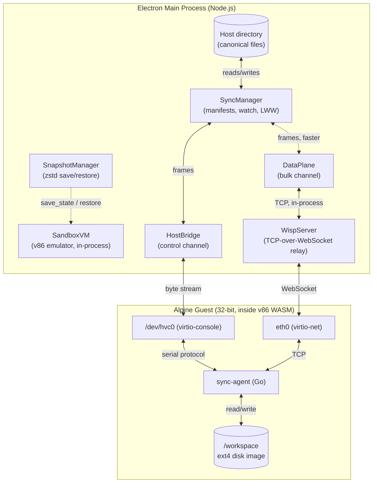
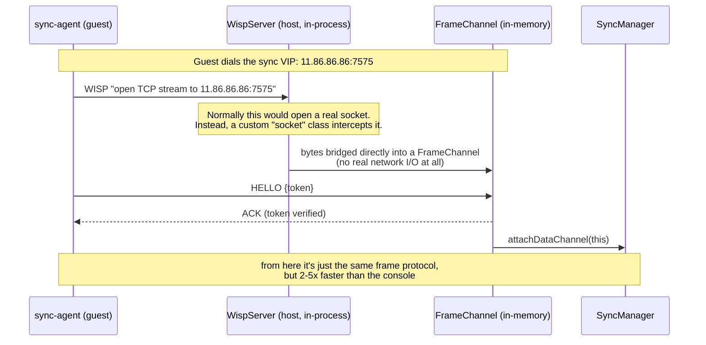
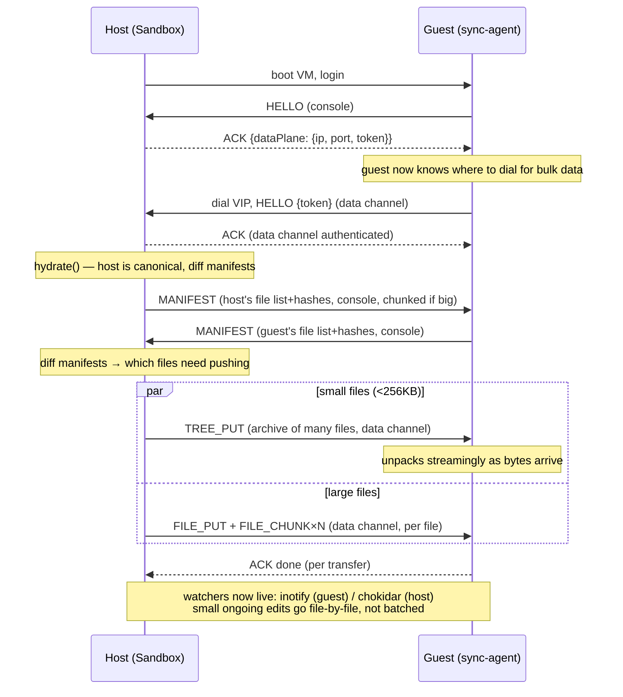
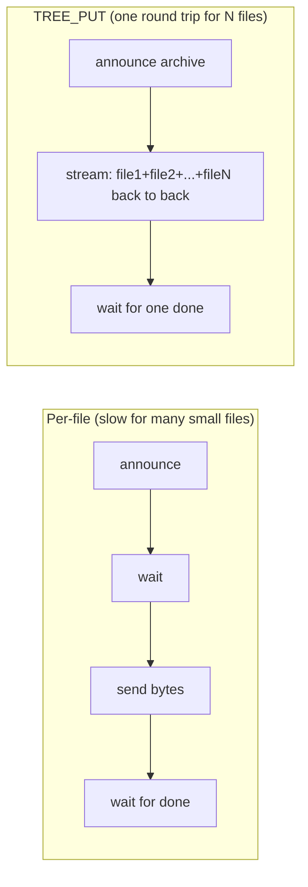

# How host↔guest sync actually works

This explains the two sync channels (console + data plane), the trick used
to get a fast TCP path through a guest that can only "dial out," and why
small files get batched. For the wire-level frame/type reference, see
[../PROTOCOL.md](../PROTOCOL.md). For the security invariants this design
upholds, see [../HARDENING.md](../HARDENING.md).

## 1. Big picture

Two independent host↔guest channels, both carrying the *same* framed
protocol, just over different plumbing:

- **Control channel** — virtio-console (`/dev/hvc0`). Basically a serial
  cable. Tiny messages, sub-millisecond latency, always available.
- **Data channel** — virtio-net, i.e. a real (emulated) network card, but
  repurposed to carry raw file bytes instead of "real" internet traffic.

## 2. The clever bit: how the data channel actually works

This is the part worth understanding carefully — it's not a normal TCP
connection to a normal server.

Recall: the guest's *only* path to any network is through WISP — a relay
where the guest asks "please open a TCP stream to IP:port" and the relay
does it on the guest's behalf over a WebSocket. WISP was built for internet
egress with an allowlist. This same mechanism carries sync traffic, without
adding a second network device.

The trick: `11.86.86.86` isn't a real destination. It's a "virtual IP" the
guest happens to dial. WISP's server code accepts an injectable socket
implementation for handling any connection — normally that's a class that
opens a real TCP socket. A custom implementation swaps in, for that one
specific IP+port, and just hands the bytes straight to an in-process
`FrameChannel` object instead of touching the network at all. Every other
destination still goes through a real socket (the normal internet
allowlist, untouched — see `wisp.ts` / `data-plane.ts`).

Why bother with this instead of just using the console for everything?
Because virtio-net + a real TCP stack gives ~12 MB/s raw throughput vs.
virtio-console's ~2.9 MB/s — the console was designed for terminal
characters, not bulk file data.

**Security note:** because the VIP is terminated in-process and never
becomes a real socket, it can't be used to reach anything else — it's not a
backdoor into the LAN. The token (random per boot, sent only over the
*console*) is the real authentication: the WISP allowlist is by IP, so
`11.86.86.86:7575` is technically whitelisted for anyone who could speak
WISP to the relay — the token is what proves a connection is genuinely the
sync-agent, independent of that IP allowlist.

## 3. Boot → hydrate flow

Two ideas worth calling out:

- **Manifests still go over the console.** They're just JSON metadata
  (paths + hashes), small and infrequent — no need for the fast channel.
- **TREE_PUT only applies during hydrate**, for small files. Once editing
  live, changes are one file at a time anyway, so there's nothing to
  batch — that traffic goes over whichever channel is active (data channel
  if connected), just using the plain per-file protocol.

## 4. Why TREE_PUT exists (the last optimization)

Before batching: each small file was its own round trip — announce it, wait
for a reply, send its bytes, wait for "done." Even on the fast channel, that
round trip through the guest's emulated network stack costs tens of
milliseconds. With 600 tiny files, that's seconds of *pure waiting*,
dwarfing the actual data (a few KB per file).

The archive format is deliberately dumb: `[length][JSON header][raw
bytes]`, repeated per entry. The guest reads that stream and, as each
file's bytes finish arriving, immediately writes it to disk — no need to
buffer the whole archive in memory first.

## A gotcha: the data plane can lose the race to connect

The guest starts dialing the data-plane VIP as soon as it gets the advert —
which arrives in the ACK to the guest's *own* early console HELLO, sent
independently of (and roughly concurrently with) the host's login handshake
over the serial console. In practice these two independent startup paths
often finish within a second of each other. On a loaded machine, or if
DHCP/WISP negotiation is slow for any reason, the data plane can lose that
race by more than a few seconds — and if the host gives up waiting too
early, hydrate would fall back to the console for the *entire* transfer,
including the expensive initial sync.

Two things make this a non-issue:

1. The host waits a generous window (25s) for the data plane before starting
   hydrate — call it `waitDataPlane` in `sandbox.ts`.
2. More importantly, `hydrate()` re-checks whether the data plane is
   connected **every time it hands out the next unit of work**, not just
   once at the start. So even if the wait above times out and hydrate
   begins on the console, a data-plane connection that completes moments
   later is picked up immediately for everything not yet claimed — no fixed
   timeout to tune, no work wasted.

## Measured numbers (this machine, see sandbox/README.md for the source run)

- Console: ~2.9 MB/s, sub-ms round trip, always available (control +
  fallback).
- Data plane raw channel: ~12 MB/s (ceiling = guest's emulated CPU, not the
  transport).
- Single large file over the data plane: ~7 MB/s.
- 802-file / 22.9 MB mixed tree, hydrate: 7.3 s over the data plane
  (TREE_PUT-batched) vs. an ~11.9 s console-only baseline for the same tree.

## Why not just use WebDAV / sshfs / NFSv4 / a live mount?

Covered in depth during design (see git history / PR description for this
work), short version: those are live network *filesystems*, and mounting
one in place of the ext4 `/workspace` disk would (a) pay tens-of-ms network
round trips per file operation — disastrous for `npm install`-style
workloads — and (b) violate the "no live host mount" security invariant in
HARDENING.md, where files must cross the boundary only as inspectable
protocol bytes and the host directory stays canonical even if the VM
corrupts itself. UDP doesn't help either: the transport here is a lossless
in-process pipe (no packet loss to tolerate), and v86's WISP backend doesn't
support UDP.
